# AIOps: Sentinel NoSQL

Um sistema multiagente inteligente desenhado para automatizar a Gestão de Incidentes (AIOps). Operando sobre um banco de dados NoSQL orientado a documentos, o sistema triagem *logs* caóticos, converte falhas técnicas em análises de impacto de negócio e despacha alertas estruturados para equipes de engenharia — eliminando a fadiga de alertas com eficiência de custo escalável.

---

## Sumário

1. [O Problema que Resolve](#o-problema-que-resolve)
2. [A Principal Entrega de Valor](#a-principal-entrega-de-valor)
3. [Arquitetura do Sistema](#arquitetura-do-sistema)
4. [Hierarquia de Informações](#hierarquia-de-informações)
5. [Modelagem do Banco de Dados](#modelagem-do-banco-de-dados)
6. [Fluxo de Processamento por Agente](#fluxo-de-processamento-por-agente)
7. [Protótipo em Funcionamento](#protótipo-em-funcionamento)
8. [Atividades Semanais](#atividades-semanais)
9. [Saídas do Sistema](#saídas-do-sistema)

---

## O Problema que Resolve

O maior gargalo na operação de *squads* de tecnologia é a **fadiga de alertas**. Desenvolvedores recebem milhares de *logs* de erro brutos diariamente, perdendo tempo valioso para identificar o que realmente impacta o usuário final.

O Sentinel NoSQL resolve este problema entregando **contexto acionável com eficiência de custo**, transformando ruído em sinal estruturado e priorizável.

---

## A Principal Entrega de Valor

Em vez de forçar os agentes de IA a se comunicarem diretamente entre si — o que consome uma quantidade massiva de *tokens* em APIs de LLM — o sistema utiliza o banco de dados (`Agentes.db`) como o único meio de comunicação entre as camadas de inteligência.

O resultado é a entrega de um *card* estruturado (pronto para Jira ou Slack) contendo apenas:

- O nível de severidade (exemplo: P1, P3)
- O impacto real no negócio (exemplo: "Carrinho de compras indisponível")
- O *squad* exato que deve atuar

Todo o processamento de texto pesado ocorre uma única vez no Agente 1. As camadas seguintes propagam apenas JSONs leves, mantendo o custo de operação sob controle mesmo em alta escala.

---

## Arquitetura do Sistema

O sistema é dividido em três agentes assíncronos e independentes. O fluxo de dados ocorre em camadas — da esquerda para a direita e de baixo para cima — usando o campo `status` do documento como mecanismo de handoff entre agentes.

```text
[Camada 3] {status: ANALISADO}  ----> Agente 3: Integrador ----> Payload Jira / Mensagem Slack
                                            ^
                                            | Atualiza status / Gera resumo executivo
[Camada 2] {status: EXTRAÍDO}   ----> Agente 2: Arquiteto  ----> Define Severidade e Impacto de Negócio
                                            ^
                                            | Grava JSON estruturado com assinatura do erro
[Camada 1] Log Bruto / TXT      ----> Agente 1: Coletor    ----> Extrai padrão de erro e agrupa por período
```


---

## Hierarquia de Informações

O sistema utiliza um banco de dados NoSQL focado em documentos, estruturados para suportar inteligência de dados a longo prazo e evitar a fadiga de alertas. As informações são organizadas em quatro camadas hierárquicas:

| Camada | Nome | Descrição |
|--------|------|-----------|
| 1 (topo) | Domínio de Negócio | Define qual área ou serviço da empresa foi afetado |
| 2 | Incidente Consolidado com Histórico Temporal | Junção do problema com a análise da IA: severidade, impacto e *buckets* de volume por período |
| 3 | Assinatura do Erro | Padrão técnico único extraído dos *logs*, usado para deduplicação |
| 4 (base) | Logs Brutos | Milhares de linhas de texto originais não estruturadas |


### Agregações para Funcionalidade do Sistema

**Agregação de Deduplicação Temporal (Padrão de Bucketing)**

Em vez de salvar 1.000 *logs* repetidos soltos no banco, o sistema agrupa os erros que possuem a mesma Assinatura em intervalos de tempo. O banco incrementa apenas um contador dentro desse período:

```json
{ "periodo": "08:00", "ocorrencias": 310 }
```

**Agregação Preditiva para Prevenção**

Ao manter o histórico no documento, a equipe de análise consegue rodar consultas no banco para descobrir padrões de comportamento. Exemplo: "O erro de conexão com o banco tem um pico de 300 ocorrências sempre às 08h da manhã."

---

## Modelagem do Banco de Dados

O banco é composto por três coleções com responsabilidades distintas.


### Coleção: `logs_brutos`

A porta de entrada do sistema. Guarda o texto sujo que vem dos servidores antes de ser processado pelo Agente 1.

```json
{
  "_id": "log_a7b8c9",
  "timestamp": "2026-05-11T08:05:12Z",
  "aplicativo": "api-pagamentos-v2",
  "texto_bruto": "[ERROR] 2026-05-11 08:05:12 - api-pagamentos-v2 - org.postgresql.util.PSQLException: FATAL: sorry, too many clients already...",
  "processado_pelo_agente_1": true
}
```

### Coleção: `contexto_negocio`

A memória fixa da IA. O Agente 2 consulta esta coleção para descobrir a qual *squad* pertence o serviço que falhou, sem depender dessa informação no *prompt*.

```json
{
  "_id": "ctx_042",
  "nome_do_servico": "api-pagamentos-v2",
  "squad_responsavel": "squad-checkout",
  "criticidade": "ALTA"
}
```

### Coleção: `incidentes`

A coleção principal. O documento é construído em camadas pelos agentes assíncronos, com o campo `status` controlando o fluxo de processamento.

---

## Fluxo de Processamento por Agente

### Agente 1: O Coletor

**Objetivo:** Organizar e limpar o texto técnico sem realizar nenhum filtro de negócio. O Agente 1 cria o documento na coleção `incidentes` com o status `EXTRAÍDO`.

Saída gerada na coleção `incidentes`:

```json
{
  "_id": "inc_999",
  "status": "EXTRAÍDO",
  "assinatura_do_erro": "PSQLException_Too_Many_Clients_api-pagamentos-v2",
  "total_de_erros": 310,
  "historico_temporal": [
    {
      "periodo": "2026-05-11T08:00:00Z",
      "ocorrencias": 310
    }
  ]
}
```

---

### Agente 2: O Arquiteto

**Objetivo do Prompt:** "Leia o incidente extraído e o Contexto de Negócio. Avalie a criticidade do banco de dados estar negando conexões na API de pagamentos."

O Agente 2 atualiza o documento existente, enriquecendo-o com a análise de negócio e alterando o status para `ANALISADO`:

```json
{
  "analise_da_IA": {
    "impacto_no_negocio": "Usuários estão sendo impedidos de finalizar compras no checkout devido a esgotamento do pool de conexões do banco de dados primário.",
    "severidade": "P1 - Crítico",
    "squad_responsavel": "squad-checkout",
    "acao_sugerida": "Aumentar o max_connections do PostgreSQL ou escalar as réplicas de leitura imediatamente."
  },
  "status": "ANALISADO"
}
```

---

### Agente 3: O Integrador

**Objetivo do Prompt:** "Leia o incidente analisado. Crie um resumo executivo curto e direto para o Slack e o payload para abrir um card no Jira."

O Agente 3 não armazena dados — ele despacha as saídas para os canais de destino.

---

## Protótipo em Funcionamento

A versão funcional do Sentinel NoSQL foi implementada em **Streamlit**, usando **TinyDB** como banco de dados orientado a documentos (substituindo um NoSQL gerenciado para fins de prototipagem rápida). Abaixo, cada tela do protótipo é apresentada seguindo a ordem natural de uso do sistema: ingestão do log bruto, cadastro do contexto de negócio, execução dos agentes, inspeção das coleções e, por fim, o dashboard consolidado.

### 1. Ingestão de Logs Brutos (Agente 1)

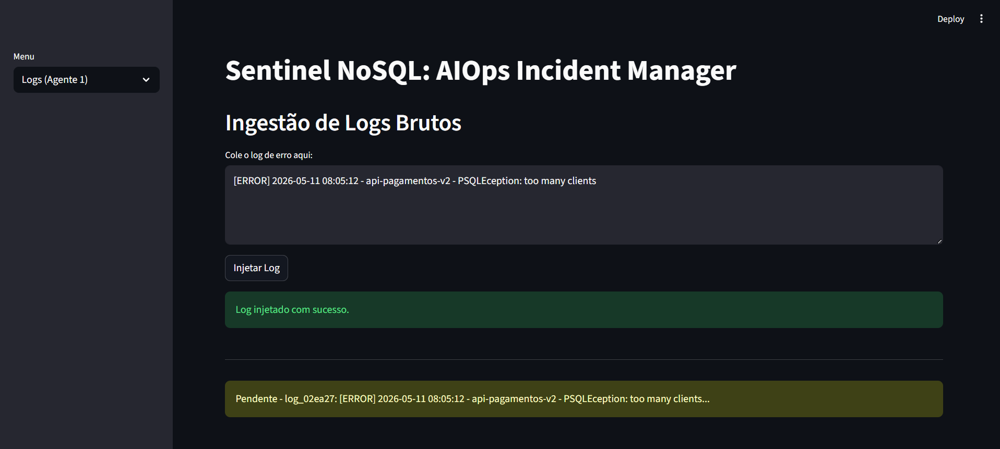

Esta é a porta de entrada do sistema, correspondente à coleção `logs_brutos`. O usuário cola o *log* de erro bruto — neste exemplo, uma exceção do PostgreSQL (`PSQLException: too many clients`) originada do serviço `api-pagamentos-v2`. Ao clicar em **"Injetar Log"**, o sistema extrai automaticamente o nome do aplicativo via *regex* e grava o documento com o *flag* `processado_pelo_agente_1: false`. Logo abaixo, a lista de **logs pendentes** mostra que o registro está aguardando processamento pelo motor de agentes.

### 2. Execução do Motor de Agentes

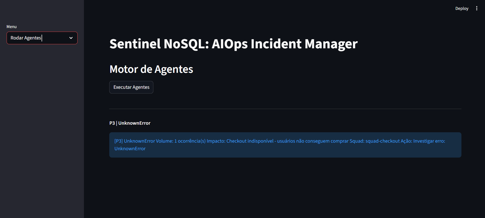

Na tela **"Rodar Agentes"**, o botão **"Executar Agentes"** dispara o pipeline completo: o Agente 1 extrai a assinatura do erro, o Agente 2 cruza essa assinatura com o contexto de negócio cadastrado e o Agente 3 formata a mensagem final. O resultado exibido — `[P3] UnknownError` — mostra que, neste caso, o texto do *log* não correspondeu a nenhum dos padrões conhecidos (`PSQLException`, `timeout`, `Slow query`, `OutOfMemory`), sendo classificado como severidade padrão `P3` com o squad e impacto associados ao serviço de pagamentos.

### 3. Cadastro de Contexto de Negócio

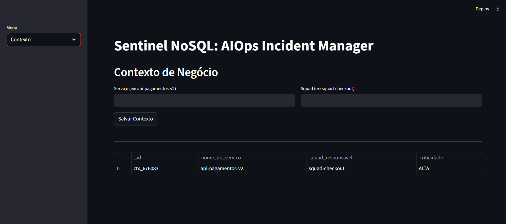

Esta tela representa a coleção `contexto_negocio`, a "memória fixa" do sistema. Aqui o usuário associa um serviço técnico (ex: `api-pagamentos-v2`) ao seu *squad* responsável (ex: `squad-checkout`) e define a criticidade do serviço. Esse cadastro é o que permite ao Agente 2 transformar um erro técnico genérico em um impacto de negócio compreensível, sem precisar reprocessar o texto bruto do *log*.

### 4. CRUD Geral — Navegação entre Coleções

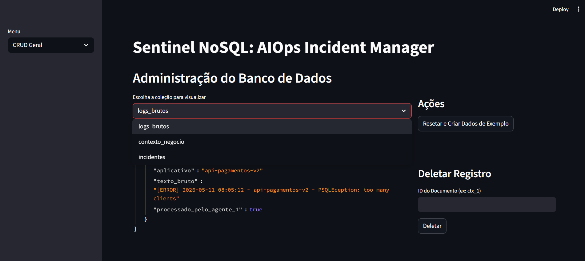

A tela **"CRUD Geral"** funciona como um painel administrativo direto sobre o `TinyDB`, permitindo alternar entre as três coleções (`logs_brutos`, `contexto_negocio`, `incidentes`) por meio de um seletor. Esta visão também expõe as ações de manutenção do protótipo, como **"Resetar e Criar Dados de Exemplo"**, útil para popular o banco com dados de teste durante demonstrações.

### 5. Inspeção da Coleção `logs_brutos`

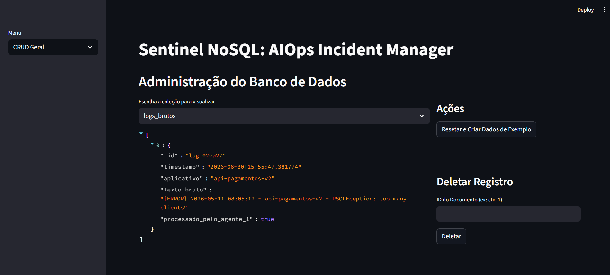

Ao selecionar a coleção `logs_brutos`, o sistema exibe o documento em formato JSON navegável. É possível conferir todos os campos gravados na etapa de ingestão: `_id`, `timestamp`, `aplicativo`, `texto_bruto` e o *flag* `processado_pelo_agente_1`, agora como `true`, confirmando que o log já foi consumido pelo motor de agentes.

### 6. Inspeção da Coleção `contexto_negocio`

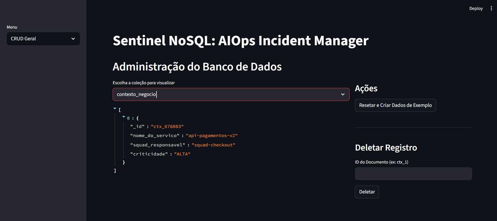

Aqui é possível visualizar o documento de contexto cadastrado anteriormente, com seus quatro campos estruturados: `_id`, `nome_do_servico`, `squad_responsavel` e `criticidade`. Essa coleção pequena e estável é o que dá ao Agente 2 a capacidade de tomar decisões de severidade sem depender de *prompts* longos ou contexto externo a cada execução.

### 7. Inspeção da Coleção `incidentes`

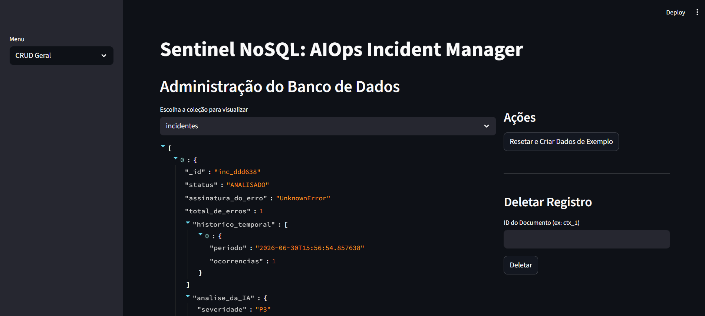

A coleção `incidentes` é o coração do sistema. O documento mostra a estrutura consolidada criada após a execução dos agentes: o `status` (`ANALISADO`), a `assinatura_do_erro`, o `total_de_erros`, o array `historico_temporal` (responsável pelo padrão de *bucketing* descrito na seção de [Hierarquia de Informações](#hierarquia-de-informações)) e o objeto `analise_da_IA` com a severidade calculada pelo Agente 2. É essa mesma estrutura que, em produção, alimentaria as integrações de saída para Slack e Jira.

### 8. Dashboard de Operações

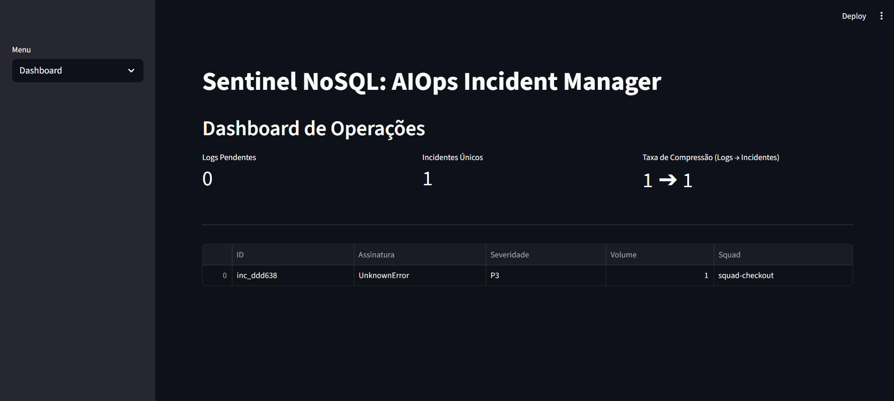

Por fim, o **Dashboard** consolida a visão executiva do sistema: número de *logs* pendentes, quantidade de **incidentes únicos** e a **taxa de compressão** (logs → incidentes), métrica que evidencia diretamente o valor do sistema — quantos eventos brutos foram agrupados em quantos incidentes acionáveis. A tabela inferior lista os incidentes mais recentes com severidade, volume e squad responsável, funcionando como o painel de triagem para as equipes de engenharia.

---

## Atividades Semanais

### Semana 4 (07/07/2026) — Aggregation Pipelines Avançadas

**Requisito:** Implementar 2 *aggregation pipelines* diferentes, cobrindo funcionalidades distintas do sistema, utilizando operadores como `match`, `group`, `sort`, `select`, `lookup`, `project`, `unwind`, `merge`, `set`, `sample`, entre outros. As pipelines foram desenvolvidas e testadas diretamente no **Data Explorer do MongoDB Atlas**, sobre a coleção `incidentes`.

#### Pipeline 1 — Ranking de Squads por Volume de Erros Críticos

**Objetivo:** identificar quais squads concentram o maior volume de erros entre os incidentes classificados como `P1` ou `P2`, permitindo priorizar a alocação de esforço de engenharia.

**Estágios:** `$match` → `$group` → `$sort`

```javascript
[
  { $match: { "analise_da_IA.severidade": { $in: ["P1", "P2"] } } },
  { $group: {
      _id: "$analise_da_IA.squad_responsavel",
      total_erros: { $sum: "$total_de_erros" }
  }},
  { $sort: { total_erros: -1 } }
]
```

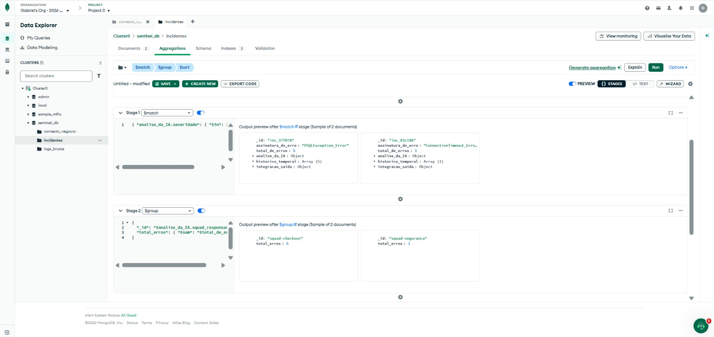
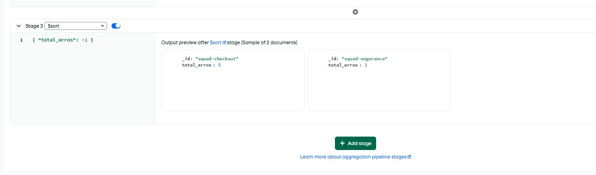

**Log de saída:**
```
_id: "squad-checkout"    total_erros: 5
_id: "squad-seguranca"   total_erros: 1
```

#### Pipeline 2 — Timeline de Eventos por Incidente

**Objetivo:** desmembrar o array `historico_temporal` de cada incidente para gerar uma linha do tempo evento a evento, útil para identificar picos de ocorrência e cruzar com a assinatura do erro e o squad responsável.

**Estágios:** `$unwind` → `$project`

```javascript
[
  { $unwind: "$historico_temporal" },
  { $project: {
      data: "$historico_temporal.periodo",
      assinatura: "$assinatura_do_erro",
      squad: "$analise_da_IA.squad_responsavel",
      _id: 0
  }}
]
```

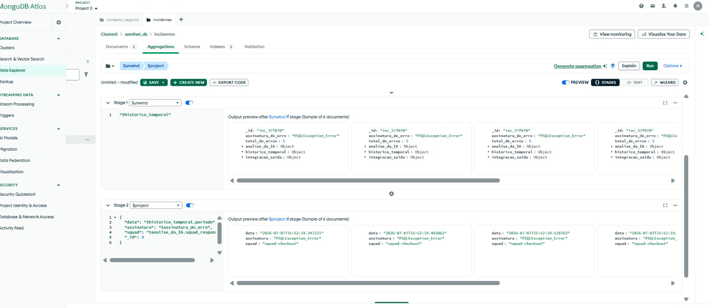

**Log de saída (amostra):**
```
{ data: "2026-07-07T15:52:19.347221", assinatura: "PSQLException_Error", squad: "squad-checkout" }
{ data: "2026-07-07T15:52:19.483862", assinatura: "PSQLException_Error", squad: "squad-checkout" }
{ data: "2026-07-07T15:52:19.528763", assinatura: "PSQLException_Error", squad: "squad-checkout" }
```

#### Índices da Coleção `incidentes`

Como evidência complementar do requisito de indexação implementado desde a versão em nuvem, seguem os índices ativos na coleção, confirmados no painel **Indexes** do Atlas:

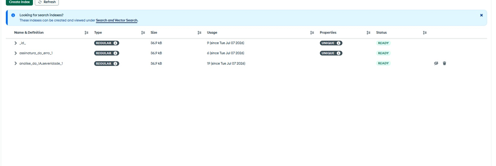

| Índice | Tipo | Propriedade | Status |
|---|---|---|---|
| `_id_` | REGULAR | UNIQUE | READY |
| `assinatura_do_erro_1` | REGULAR | UNIQUE | READY |
| `analise_da_IA.severidade_1` | REGULAR | — | READY |

---

## Saídas do Sistema

### Mensagem para o Webhook do Slack

```
*INCIDENTE CRÍTICO (P1) - squad-checkout*

*Serviço:* api-pagamentos-v2
*Impacto:* Usuários impedidos de finalizar compras no checkout. (Banco de dados sem conexões).
*Volume:* 310 ocorrências agrupadas na última hora (Pico às 08h00).
*Ação Sugerida:* Aumentar o `max_connections` do PostgreSQL.

<link_para_o_jira|Acompanhar Ticket CHK-1042>
```

### Payload para a API do Jira

```json
{
  "fields": {
    "project": { "key": "CHK" },
    "summary": "[P1] Falha de Conexão DB - api-pagamentos-v2",
    "description": "O sistema detectou 310 erros de 'too many clients' no PostgreSQL da API de pagamentos às 08h. Impacto: Checkout indisponível. Sugestão: Revisar pool de conexões.",
    "issuetype": { "name": "Bug" },
    "priority": { "id": "1" }
  }
}
```